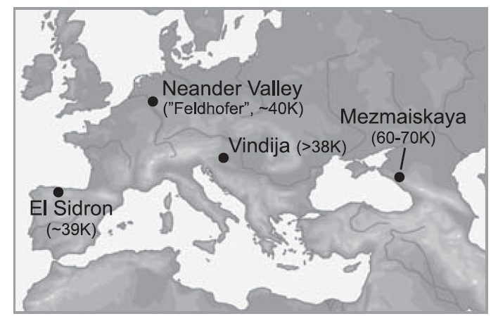

 

# Introduktion til evolutionsbiologi

## Hans R. Siegismund

Formålet med denne øvelse er at præsentere en række vigtige termer og
begreber, som anvendes i forbindelse med undervisningen i kurset
Evolutionsbiologi. Denne øvelsesgang vil derfor kort introducere mange
forskellige emner som dog i løbet af kurset vil blive gennemgået i langt
flere detaljer. Den faglige intention med øvelse 1 er således at skabe
et overblik over kursets indhold – en slags evolutionært potpourri om
man vil. Vi håber derfor, at man efter denne øvelse er bedre rustet til
at læse lærebogen og forstå de efterfølgende forelæsninger og øvelser.

Den vigtigste forudsætning for biologisk evolution er ***genetisk
variation***. Uden variation kan der ikke ske nogen evolution. Vi tager
udgangspunkt i variation i naturlige populationer. En ***population***
defineres her som en gruppe organismer af samme art, som findes i et
mere eller mindre veldefineret geografisk område. Økologiske og
reproduktive interaktioner mellem individer er mere hyppige inden for
populationer end mellem forskellige populationer

Genetisk variation i en population påvirkes af flere evolutionære
kræfter. Den produceres ved ***mutation*** og ***rekombination***.
**Den** ændres tilfældigt gennem ***genetisk drift***. Den er en
forudsætning for ***naturlig selektion***, hvor biologiske enheder
(individer, f.eks.) har en genetisk betinget forskel i ***fitness***,
d.v.s. deres evne til at overleve og reproducere. Populationer indenfor
en art differentieres genetisk over tiden, dels på grund af tilfældig
genetisk drift og dels på grund af naturlig selektion, der kan virke
forskelligt i forskellige miljøer. Over tid kan populationer
differentieres så meget, at der vil opstå ***reproduktiv isolation***,
og der vil da være tale om nye ***arter***. Gentagne ***artsdannelser***
– kombineret med divergens – resulterer i det forgrenede netværk af
arter man kan se i et ***fylogenetisk træ***. De følgende opgaver giver
en introduktion til de ovennævnte begreber.

## Mutation

Mutationer (og rekombinationer) er basis for al variation observeret i
naturlige populationer. Mutationsrater angives ofte i forskellige
enheder. For enkelte gener benyttes ofte enheden mutationer per
generation. For DNA- (eller RNA-sekvenser) benyttes ofte enheden
mutationer per base per tidsenhed (ofte år). De næste opgaver
illustrerer disse to eksempler.

### Opgave 1 (Mutationer i DNA sekvenser)

 <figure>
  
 </figure>

Mutationsrater for DNA sekvenser kan f. eks. bestemmes ved at sammenligne sekvenser fra to arter, der har udviklet sig uafhængigt af hinanden; antag at de blevet splittet op for *T* år siden. Med en mutationsrate *μ* (per site per år) forventer vi, at der i hver linje for en sekvens, der er *L* baser lang, vil være opstået *μTL* mutationer, se figuren til højre. Vi antager her, at der ikke forekommer to mutationer på samme position. Så er det totale antal nukleotidforskelle mellem de to sekvenser givet ved

$\footnotesize D = 2 μTL$

hvor to-tallet skyldes, at der akkumuleres mutationer i hver af de to
linjer. Kendes mutationsraten *μ* for et gen, kan man således ud fra antallet af
nukleotidforskelle, *D*, mellem to sekvenser beregne hvor lang tid siden
de splittedes ad,

$\footnotesize T = D/(2L).$

 <figure>
  
 </figure>

Vi vil her benytte dette til at bestemme alderen på en hidtil ukendt
menneske-art. I 2008 fandt man i Denisova-hulen i Altai bjergene i det
sydlige Sibirien den yderste fingerknogle fra en lillefinger, af hvad
man først troede, var et menneske. Fundet er mellem 30.000 og 48.000 år
gammelt. Det lykkedes dog at ekstrahere DNA fra knoglen og at sekventere
hele mitokondriegenomet på *L* = 16.570 basepar. En sammenligning med
menneskesekvenser viste at det gennemsnitlige antal forskelle var *D* =
385, hvilket er cirka dobbelt så stor som det gennemsnitlige antal
forskelle mellem mennesket og neandertaleren.[^1] Fundet repræsenterer
derfor en ny enhed i slægten *Homo*; men man har afstået fra at tildele
det et artsnavn, da det fundne materiale er så begrænset.

For humane mitokondrier har man skønnet, at den gennemsnitlige
mutationsrate er *μ* = 1,1 × 10-8 per base per år.

  1)  Benyt denne oplysning til at beregne tiden for opsplitningen mellem
    dette nye fund og mennesket.

Klik for at se svaret.

 T = 385 / (2 × 1,1 × 10-8 × 16570) år  = 1.056.126 år

(Den helt korrekte besvarelse ville have taget højde for, at Neandertalerens gren faktisk er en smule kortere, da den har levet indtil for ca 39.000 år siden.  Tiden bliver så ca. 20.000 år mindre.)

  2)  Hvorfor er det mitokondrielle gener, man ofte ser sekventeret fra
    gamle prøver?

Klik for at se svaret.

Mitokondrier findes i langt flere kopier end det nukleare genom i hver celle og har derfor en større sandsynlighed for at blive bevaret.

### Opgave 2 (Mutationer i enkelte gener)

Lægen Mørch fandt blandt 94.000 fødsler i Danmark 10 tilfælde af
chondrodystrofe dværge. Denne form for dværgvækst er dominant betinget: Personer med normal vækst har genotypen *dd*, medens chondrodystrofe har genotypen *Dd*. Det antages, at individer med genotypen *DD* ikke observeres, fordi genotypen er letal. 
Der foreligger yderligere oplyst, at 3 af de 10 fødte dværge havde en
chondrodystrof forælder, mens 7 havde normale forældre; det vil sige, at
der optræder 7 nye mutationer i populationen.

1)  Beregn ud fra disse oplysninger et skøn over mutationsraten.

Klik for at se svaret.

Blandt de nyfødte optræder der 7 nye mutationer.  Vi finder så mutationsraten som

μ = 7 / (2 × 94.000)  = 3.7 × 10-5

Bemærk, det er mutationsraten per generation. Man kunne godt have trukket 3 fra 2 × 94.000 for at finde den helt korrekte rate, hvormed alle d gener i populationen har muteret.  Det ville ikke ændre noget på ovenstående resultat.

## Variation i naturlige populationer

### Opgave 3 (Variation i et autosomalt locus med dominans mellem allelerne

Denne opgave illustrerer basale forskelle mellem traditionel Mendelsk
genetik baseret på kontrollerede forsøg og på observationer indsamlet i
naturlige populationer. I en stor naturlig plantepopulation var forholdet imellem planter med røde og planter med hvide blomster ca. 3:1. Blomsterfarven bestemmes af et autosomalt gen med to alleler, hvor den ene allel er dominant og den anden er recessiv.

1)  Hvad fortæller det om dominansforholdene imellem røde og hvide
    blomster?

Klik for at se svaret.

Intet som helst. Dominansforhold har ingen indflydelse på en given allels hyppighed i en population. 

Mange er nok blevet vildledt af de kendte Mendelske 3:1 udspaltninger.

2)  Hvis du skulle undersøge dominansforholdene nærmere, hvilke
    krydsninger ville du så foretage?

Klik for at se svaret.

Man kunne lave et antal krydsninger med

Rød × Rød

og

Hvid × Hvid

Hvis hvid er recessiv, ville krydsningen Hvid × Hvid udelukkende give hvidt afkom, medens nogle af krydsningerne Rød × Rød ville spalte ud med hvidt afkom. Det sidstnævnte sker i de tilfælde, hvor begge forældre er heterozygote, og vi forventer her en 3:1 udspaltning af røde til hvide.	Hvis Rød var recessiv, ville udspaltningerne være omvendte.

### Opgave 4

Rhesus-systemet er af stor betydning ved blodtransfusioner og kan
forvolde komplikationer ved graviditeter, hvor kvinde og foster har
uforenelige blodtyper. Der findes to fænotyper i Rhesus-systemet:
Rhesus-positiv (Rh+) og Rhesus-negativ (Rh−). Den følgende tabel viser
udspaltninger i Rhesus-systemet hos de tre mulige forældrekombinationer:

|                     |                |Børn |     |
|---------------------|----------------|-----| --- |
| Forældrekombination | Antal familier | Rh+ | Rh− |
| Rh+ × Rh+           | 73             | 248 | 16  |
| Rh+ × Rh−           | 20             | 54  | 23  |
| Rh− × Rh−           | 7              | −   | 34  |

(Fra Frydenberg og Spärck (1963)*: Arv og race hos mennesket.*)

1)  Hvordan nedarves variationen i Rhesus-systemet? Det vil sige, hvor
    mange alleler indgår, og hvilke genotyper resulterer i hvilke
    fænotyper?

Klik for at se svaret.

Tabellen over udspaltningen i Rhesus-systemet viser tydeligt, at kombinationen Rh− × Rh− udelukkende får Rh− børn, medens kombinationerne Rh+ × Rh+ og Rh+ × Rh− kan få både Rh+ og Rh− børn. Rhesus-systemet må derfor nedarves dominant. Hvis vi benytter betegnelserne Rh for den dominante og rh for den recessive allel, kan genotyperne og fænotyperne gives ved

|Genotype|Fænotype|
|:------:|:------:|
|RhRh    |Rh+     |
|Rhrh    |Rh+     |
|rhrh    |Rh−     |

### Opgave 5 (Nukleotiddiversitet for DNA-sekvenser)

This is an inline equation: $$V_{sphere} = \frac{4}{3}\pi r^3$$, 
followed by a display style equation:

$$V_{sphere} = \frac{4}{3}\pi r^3$$

Nukleotiddiversiteten, *π*, er et simpelt mål for variationen på
DNA-sekvens niveau. Den måles som det gennemsnitlige antal
nukleotid-forskelle per base mellem DNA-sekvenser fra en population. Den
kan beregnes på en meget simpel måde. Hvis man har sekventeret et vist
antal sekvenser fra den samme population, bestemmes alle parvise
forskelle mellem sekvenserne og divideres bagefter med antallet af
sammenligninger og sekvensernes længde.  For eksempel, hvis man har fire sekvenser, der er tusind basepar lange, med de parvise forskelle givet i den følgende tabel

|                     |[1] | [2] | [3] |[4]   |
|-------------------- |--- |---  |---- |------|
|[1] Sekvens 1	       | -  |     |     |      |
|[2] Sekvens 2        |10  | -   |     |      |
|[3] Sekvens 3	       |15  | 20  | -   |      |
|[4] Sekvens 4	       |18  | 17  |27   | -    |

så beregnes nukleotiddiversiteten som 

$$\pi = \frac{(10+15+20+18+17+27)}{100\times6}=107/600=0,018 $$

 <figure>
  
 </figure>

Vi skal i denne øvelse beregne nukleotid-diversiteten for
Neandertaleren. Briggs *et al.* (2009)[^2] publicerede sekvenserne for
hele mitokondriet fra fem forskellige Neandertaler-prøver. Findestederne
er angivet på figuren til højre. På figuren er også angivet alderen af
prøven (K står for kilo = 1.000). Udover de fem sekvenser fra Brigss *et al.* (2009)
findes yderligere en sekvens med et helt mitokondrielt genom. Den 
følgende tabel viser det parvise antal forskelle mellem alle seks mitokondrier:

|                   |\[1\] |\[2\] | \[3\]| \[4\]| \[5\]| \[6\]|
|-------------------|-----:|-----:|-----:|-----:|-----:|-----:|
|\[1\] Feldhofer1   |      |      |      |      |      |      |
|\[2\] Feldhofer2   | 10   |      |      |      |      |      |
|\[3\] ElSidron1253 | 10   | 6    |      |      |      |      |
|\[4\] Vindija33.25 | 0    | 10   | 10   |      |      |      |
|\[5\] Mezmaiskaya  |46    | 40   | 44   |46    |      |      |
|\[6\] Vindija33.16 |10    | 8    |10    |10    | 46   |      |

Neandertalerens mitokondrielle genom har en længde på *L* = 16.565
basepar.

1)  Beregn nukleotiddiversiteten *π* for Neandertalerens mitokondrielle
    genom.
    

Klik for at se svaret.

$$x+y=\pi $$
aaa
 $$
 \begin{align}\pi &= \frac{10 + 10 + 6 + 0 + 10 + 10 + 46 + 40 + 44 + 46 + 10 + 8 + 10 + 10 + 46}                                     {15\times16.565}\\
 &=0,012\\
\end{align} 
$$

For det moderne menneske har man bestemt nukleotiddiversiteten til at
være 0,0037.

2) Hvad kan forklaringen på forskellen mellem nukleotiddiversiteten i
    mennesket og Neandertaleren være?

Klik for at se svaret.

Neandertaleren har formentlig haft en lavere populationsstørrelse end mennesket. Her spiller genetisk drift en større rolle og fjerner mere variation i hver generation (se den følgende opgave), så nukleotiddiversiteten bliver lavere.

**Tilfældig genetisk drift**

Genetisk drift opstår på grund af populationers endelige størrelse. Som nævnt, taler vi om tilfældig genetisk drift. Hermed mener vi, at allelfrekvenser i et locus ændrer sig tilfældigt fra generation til generation.  Vi starter, for eksempel, 100 populationer med en størrelse på hver 20 diploide individer i generation 0. De er alle polymorfe med to alleler, *A*1 og *A*2, der hver har en frekvens på 0,5. Med tiden vil de enkelte populationers allelfrekvenser ændre sig og bevæge sig bort fra 0,5, se den følgende figur. Efter tilstrækkelig lang tid forventer vi, at populationerne bliver fikseret for enten den ene eller den anden allel. Populationerne bliver fikseret med de to alleler med den frekvens, allelerne havde i generation 0. I vores tilfælde forventer vi, at halvdelen af populationerne fikseres for *A*1 og den anden halvdel fikseres for allel *A*2. Jo mindre en population er, des stærkere virker genetisk drift. Vi skal i den følgende øvelse se på genetisk drifts virkning.

 <figure>
  
 </figure>

### Opgave 6
En genetiker starter et forsøg med *Drosophila melanogaster*, hvor han
benytter 10 populationer, der hver holdes på en konstant størrelse på 8
hanner og 8 hunner i hver generation. I generation 0 er alle individer
heterozygote for to alleler, *A*1 og *A*2 i et
autosomalt locus. Efter 19 generationer ses følgende fordeling af
frekvenser for allel *A*1 i de 10 populationer:

0,18 0,00 0,18 0,25 0,30 0,19 0,16 0,00 0,15 0,00

1)  Kan denne fordeling af allelfrekvensen forklares med genetisk drift?

Klik for at se svaret.

a

2)  Hvilken anden evolutionær kraft har også virket under dette forsøg?

Klik for at se svaret.

a

## Naturlig selektion

I Darwin’s bog fra 1859 “Arternes Oprindelse – ved naturlig selektion
eller bevarelse af de bedst tilpassede racer i kampen for tilværelsen”
er naturlig selektion den centrale proces, hvormed arter udvikler sig.
Naturlig selektion sker på baggrund af nogle simple observationer:

- **Variation:** Individerne i en population er forskellige fra hinanden
- **Arv:** Variationen er til dels arvelig.
- **Forskel i reproduktivt succes:** Individer med bestemt træk
  overlever og reproducerer sig med større succes end individer uden
  disse træk.

Efter selektionen vil de gener, der har bidraget til individers forøgede
overlevelse og reproduktion at være steget i hyppighed. Et centralt
begreb, som er knyttet til naturlig selektion, er fitness.

***Fitness*** kan defineres som en biologisk enheds evne til at overleve
og reproducere sig. (Den biologiske enhed kan f.eks. være et individ.)

### Opgave  7
Vi skal i denne opgave beregne fitness for to kloner i en simpel
organisme, *A* og *B*. De fødes, overlever og forplanter sig en enkelt
gang og dør. Sandsynligheden for at overleve til den reproduktive alder
og antal afkom er givet i nedenstående tabel

|Klon                   |*A*    |  *B*|
|----                   |---    |  ---|
|Overlevelse       |   0,1  | 0,2  |
|Antal afkom      |  120   | 40   |

Den samlede ***absolutte fitness*** kan beregnes som sandsynligheden for
at overleve multipliceret med antallet af afkom, som et individ får.

1)  Beregn de to kloners absolutte fitness.

Klik for at se svaret.

a

2)  Beregn de to kloners ***relative*** ***fitness***, der findes ved at
    dividere med den største absolutte fitness.

Klik for at se svaret.

a

3)  Hvilket udfald forventes i et eksperiment, når man starter med lige
    mange af hver klon i generation 0?

Klik for at se svaret.

a

## Arter

Der findes mange definitioner af arter. Et vidt accepteret er ***det
biologiske artsbegreb***, som blev introduceret af Ernst Mayr i 1942.
Ifølge det biologiske artsbegreb er en art en gruppe af populationer,
der er reproduktivt adskilt fra andre grupper af populationer. Her
fokuseres på ***reproduktiv isolation***, der dog ikke behøver at være
100%. Mange arter hybridiserer i en vis grad, uden at de derved mister
deres genetiske integritet. For eksempel, rødspætte (*Pleuronecta
platessa*) og skrubbe (*Platichthys flesus*) hybridiserer jævnligt, og
hybriden kaldes for en “leps”.

### Opgave 9

 <figure>
  
 </figure>

Knowlton et al. (1993) har undersøgt morfologisk og genetisk variation hos 12
arter af rejer, der findes i Stillehavet og Atlanterhavet på hver side
af Panama landtangen. Alderen af tangen er ca. 3 millioner år. Før den
tid var Stillehavet og Atlanterhavet forbundet med hinanden i dette
område. Forskerne delte rejerne op i seks morfologisk definerede grupper
(1 til 6 i figuren) og undersøgte deres indbyrdes slægtskab ved hjælp af
mitokondrielle DNA-sekvenser. Det fylogenetiske træ er vist til højre.
“Pacific” og “Caribbean” er arter, som findes i henholdsvis Stillehavet
og Atlanterhavet.

1)  Hvordan kan slægtskabet mellem de 12 arter karakteriseres, når man
    tager geografien i betragtning?

Klik for at se svaret.

a

2)  Hvordan kan dannelsen af de seks artspar forklares?

Klik for at se svaret.

a

[^1]: Krause *et al* 2010. The complete mitochondrial DNA genome of an
    unknown hominin from southern Siberia. *Nature* **464**: 894–897.

[^2]: Briggs, A.W. *et al.* 2009. Targeted retrieval and analysis of
five Neandertal mtDNA genomes. S*cience* **325**: 318–321.
