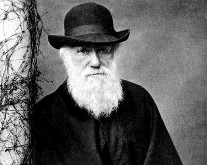

 

# Naturlig Selektion

 

## Hans R. Siegismund
 

## Teoretisk baggrund
 
Darwin's evolutionsteori fra 1859 var i det væsentlige baseret på
naturlig selektion, som sker på baggrund af nogle simple observationer:

- **Variation:** Individerne i en population er forskellige fra hinanden
- **Arv:** Variationen er til dels arvelig.
- **Forskel i reproduktiv succes:** Individer med bestemt træk overlever
  og reproducerer sig med større succes end individer uden disse træk.

Med disse tre principper var Darwin i stand til at forklare evolutionen
ved naturlig selektion. Han argumenterede, at en population af en given
art indeholder individer, der varierer i karakterer af betydning for
tilpasningen til deres miljø. De bedst tilpassede individer har større
chancer for at overleve og reproducere sig. På grund af arv vil de
derfor delvist videregive egenskaberne til næste generation, som så vil
være bedre tilpasset til miljøet end forældrene var det i generationen
før

 <figure>
  
 </figure>

Vi vil nu se på, hvorledes Darwin’s tre principper kan formuleres mere
præcist. Betragt en diploid organisme, der er polymorf i et autosomalt
locus med to alleler, *A*1 og *A*2. Den antages at
have ikke-overlappende generationer. Vi ønsker at beskrive en model for,
hvordan naturlig selektion virker på polymorfien. Vi indskrænker os til
en model, hvor vi analyserer naturlig selektion, der virker gennem
forskellig overlevelse hos de tre mulige genotyper. Deres sandsynlighed
for at overleve til det voksne stadium er givet i form af deres
***fitness***, *W*11,*W*12 og *W*22.
Det antages at hver generation starter med tilfældig sammensmeltning af
gameter. Vi får derfor, at zygoterne starter deres liv med
Hardy-Weinberg proportioner, se tabellen nedenfor. De overlevende f.eks.
for *A*11 er så *p*2*W*11. For at finde
hyppighederne blandt de overlevende må vi dividere med summen af de
overlevende,

$$
 \overline{W} =p^2W_{11}+2pqW_{12}+q^2W_{12} 
$$

der sigende betegnes som ***populationens gennemsnitlige fitness***. Man
kan så finde næste generation frekvens for allel *A*1 som

$$
\begin{align}
p' &=(p^2W_{11}+2pqW_{12}/2)/\overline{W}\\
   &=(p^2W_{11}+pqW_{12})/\overline{W}
\end{align}
$$

  $\overline{W}$

Frekvensen for allel *A*2 bestemmes tilsvarende. Det hele kan
sammenfattes i den følgende tabel

 $$
\begin{aligned}%[llcc]
\begin{array}{lccc}
                              & A_{11}      &  A_{12}     & A_{22} & \hbox{Sum}\\
 \hline
\hbox{Zygoter}\qquad          &  p^2         & 2pq        & q^2       &1 \\
\hbox{Fitness}\qquad          &  W_{11}      & W_{12}     & W_{22}    & \\
\hbox{Overlevende}\qquad      &  p^2W_{11}   & 2pq W_{12} & q^2W_{22} & \overline{W}\\
\hbox{Frekvens}\qquad         &  p^2W_{11}/\overline{W}   & 2pq W_{12}/\overline{W} & q^2W_{22}/\overline{W} & 1\\
\hbox{Næste generation}\qquad &  p'^2         & 2p'q'        & q'^2       &1 \\
\end{array}
\end{aligned}
  $$
  
Vi kan nu gentage hele processen for at finde allelfrekvenserne i den
næste generation. Det foregår på tilsvarende vis som angivet foroven.
Man kan ikke finde en generel løsning på iterationsligningerne, hvor
allelfrekvenserne i en vilkårlig generation *n* kan udtrykkes som en
funktion af allelfrekvenserne i generation 0 samt de genotypiske
fitness-værdier *W*11, *W*12 og *W*22.
Selv om man ikke kan finde en generel løsning, er det dog muligt at
analysere selektionens virkning på polymorfien. Dette gøres ved at se på
ændringen af allelfrekvensen. For allel *A*1 kan denne
ændring beregnes som
  
$$
\begin{aligned}
\begin{array}{rl}
\Delta p & = p'-p\\
         & = (p^2W_{11} +pq W_{12})/\overline{W}\\
         & = pq[(p(W_{11} - W_{12})-q(W_{22} - W_{12})]/\overline{W}
 \end{array}
\end{aligned}
$$

(Efter nogle udregninger.) Vi ønsker at finde eventuelle ligevægte, hvor
der må gælde at

$$
\begin{aligned}
\begin{array}{rl}
\Delta p & =  pq[(p(W_{11} - W_{12})-q(W_{22} - W_{12})]/\overline{W}\\
         & = 0
 \end{array}
\end{aligned}
$$

Der findes tre mulige ***ligevægte***. To trivielle, hvor enten *p* = 0,
eller hvor *q* = 0. Det vil sige, hvis det studerede locus er fikseret
for enten den ene eller den anden allel. Den tredje mulige ligevægt
eksisterer, hvis ligningen

$$
  p(W_{11} - W_{12})-q(W_{22} - W_{12}) =0
 $$

har en løsning med allelfrekvenserne i intervallet fra 0 til 1.
Ligningen kan løses efter *p* (hvor vi husker, at *q* = 1 – *p*).

$$
  p = \frac{W_{22} - W_{12}}
            {W_{11} - W_{12} +W_{22} - W_{12}} 
 $$

Der findes to løsninger med allelfrekvenserne i intervallet mellem 0 og
1, nemlig én hvis

  $W_{22} > W_{12} \hbox{\quad og \quad} W_{22} > W_{12}$

Det vil sige, at heterozygoten har mindre fitness end begge homozygoter.
En anden mulighed er hvis

  $W_{22} < W_{12} \hbox{\quad og \quad} W_{22} < W_{12}$

Det vil sige, at heterozygoten har større fitness end begge homozygoter.
Vi vender tilbage til disse løsninger senere.For et autosomalt locus med to alleler, hvorpå der virker
overlevelsesselektion på genotyperne, findes der fire principielle
muligheder for selektionens virkning.

**1) Retningsselektion** 
$W_{11}  \geq W_{12}  \geq W_{22} $ 
med højst ét lighedstegn
Der må højst være ét lighedstegn i relationen mellem de tre
fitness-værdier, for ellers har alle tre genotyper de samme
fitness-værdier, og så virker naturlig selektion ikke på dette locus. I
dette tilfælde vil naturlig selektion øge frekvensen af allel
*A*1, indtil den fikseres i populationen. Der findes ***to
ligevægte*** for allel *A*1.

0: som er ***ustabil***, dvs, hvis man ændrer frekvensen af
*A*1 lidt fra 0, vil den bevæge sig bort fra 0.

1: som er ***stabil***, dvs, hvis man ændrer frekvensen af allel
*A*1 lidt fra 1, vil den bevæge sig tilbage til 1.

**2) Retningsselektion**
$W_{11}  \le W_{12}  \le W_{22} $ 
med højst ét lighedstegn

Dette system er ækvivalent til det første, nu vil naturlig selektion øge
frekvensen af allel *A*2. Der findes ***to*** ***ligevægte***
for allel *A*1

0: som er ***stabil***, dvs, hvis man ændrer frekvensen af
*A*1 lidt fra 0, vil den bevæge sig tilbage til 0.

1: som er ***ustabil***, dvs, hvis man ændrer frekvensen af allel
*A*1 lidt fra 1, vil den bevæge sig bort fra
1.

**3) Underdominans**
$W_{11}  > W_{12} \hbox{\quad og \quad}  W_{22} > W_{12} $
I dette tilfælde har heterozygoten en mindre fitness end begge
homozygoter. Der er tale om ***underdominans***. Evolutionen i et locus
med denne relation mellem genotypernes fitness forløber fundamentalt
anderledes end i de ovennævnte tilfælde. Vi har nu ***tre ligevægte***
for polymorfien.

0: som er ***stabil***, dvs, hvis man ændrer frekvensen af allel
*A*1 lidt fra 0, vil den bevæge sig tilbage til 0.

1: som er ***stabil***, dvs, hvis man ændrer frekvensen af allel
*A*1 lidt fra 1, vil den bevæge sig tilbage til 1

  
$\frac{W_{22} - W_{12}}{W_{11} - W_{12} +W_{22} - W_{12}}$: 
som er en ***ustabil ligevægt***, dvs, hvis man ændrer frekvensen af allel
*A*1 lidt fra ligevægten, vil den bevæge sig bort fra den.

I dette system vil vi ende op med en allelfrekvens af *A*1 på
enten 0 eller 1, afhængigt af, om der startes under eller over den
ustabile ligevægt.
   
**4) Overdominans**
$W_{11}  < W_{12} \hbox{\quad og \quad}  W_{22} < W_{12} $
I dette tilfælde har heterozygoten en større fitness end begge
homozygoter. Der er tale om ***overdominans***. Vi har nu igen ***tre
ligevægte*** for polymorfien, men i modsætning til underdominans har vi
nu en ***stabil indre ligevægt***

$\frac{W_{22} - W_{12}}{W_{11} - W_{12} +W_{22} - W_{12}}$: 
som er en ***stabil ligevægt***, dvs, hvis man ændrer frekvensen af allel
*A*1 lidt fra ligevægten, vil den bevæge sig tilbage til den.

0: som er ***ustabil***, dvs, hvis man ændrer frekvensen af allel
*A*1 lidt fra 0, vil den bevæge sig bort fra 0 og hen mod den
stabile ligevægt.

1: som er ***ustabil***, dvs, hvis man ændrer frekvensen af allel
*A*1 lidt fra 1, vil den bevæge sig bort fra 1 og hen mod den
stabile ligevægt.

I dette system vil vi ende op med en frekvens af allel *A*1,
som er givet ved formlen foroven, uafhængigt af om der startes under
eller over den stabile ligevægt. Man kan vise, at det kun er de
***relative fitnessværdier***, der betyder noget for evolutionen: det
vil sige, det er lige meget om *A*11, *A*12 og
*A*22 har fitnessværdierne 10, 20, og 10 eller 1, 2 og 1.
Derfor kan vi normere værdierne, hvor vi sætter den højeste værdi til 1.
I det nævnte tilfælde bliver værdierne så ½, 1 og ½. Generelt kan vi
udtrykke fitnessværdierne som i følgende tabel

*A*11 *A*12 *A*22

———————————————————————————

Fitness *W*11 *W*12 *W*22

Relativ fitness 1 – *s* 1 1 – *t*

Selektionskoefficient *s* 0 *t*

Fitnessværdiernes difference fra 1 betegner vi som
***selektionskoefficent***. Vi kan derfor udtrykke ligevægtspunktet for
overdominans ved hjælp af selektionskoefficienterne *s* og *t.*

**Ændring i populationens gennemsnitlige fitness**

Darwin’s grundlæggende observation var, at de bedst tilpassede individer
overlever og forplanter sig med en større sandsynlighed end andre. Da
forskellen er delvis genetisk betinget, må den følgende generation være
bedre tilpasset. En essentiel følge heraf er, at populationens
gennemsnitlige tilpasning vokser generation for generation. Vi vil her
se på, hvorledes dette er relateret til modellerne for zygotisk
selektion, som er beskrevet foroven.

Lad os tage et simpelt eksempel, hvor de tre genotypers fitness kan
beskrives som

*A*11 *A*12 *A*22

———————————————————————————

> Relativ fitness 0,6 1 0,4
>
> Selektionskoefficient 0,4 0 0,6

For dette simple system ses, at ligevægten er *p* = 0,6/(0,4 + 0,6) =
0,6. Ligegyldigt hvor vi starter med frekvensen af allel
*A*1, så ender vi op i ligevægtspunktet. Vi afbilder nu
populationens gennemsnitlige fitness

> 

som funktion af allelfrekvensen, hvilket er gjort i figuren til højre.
Når *p* = 0 er der udelukkende *A*22 i populationen, som har
en
på
0,4, og når populationen er fikseret for *A*1, så er
*=*
0,6. Vi ser, at
har
sit maksimum i ligevægten 0,6. Dermed stemmer evolutionen i dette simple
system fint overens med vores intuition for evolution gennem naturlig
selektion. ***Naturlig selektion virker ved at øge den gennemsnitlige
fitness over tid. Den har sit maksimum i den stabile ligevægt.*** Dette
gælder også for de øvrige tilfælde, retningsselektion og underdominans.

I tilfældet med underdominans kan det dog hænde, at naturlig selektion
ikke ender med et ***globalt maksimum*** for
,
men kan ende op i et ***lokalt maksimum*** for
*.*
Lad os tage et simpelt eksempel, hvor de tre genotypers fitness kan
beskrives som

*A*11 *A*12 *A*22

———————————————————————————

> Relativ fitness 1,4 1 1,6
>
> Selektionskoefficient –0,4 0 –0,6

Her skal vi ikke lade os forstyrre af de negative
selektionskoefficienter. Det betyder blot, at de to homozygoter har en
højere fitness end heterozygoten. Her er ligevægten *p* = –0,6/(–0,4 –
0,6) = 0,6. Afbildes
som
funktion af frekvensen af allel *A*1, får vi figuren til
højre. Det ses, at når vi starter med en frevens af allel
*A*1 under ligevægtsfrekvsensen, ender vi med en fiksering af
allel *A*2, medens vi får fikseret allel *A*1, når
vi starter med en frekvens over ligevægten. Naturlig selektion øger
altid den gennemsnitlige fitness i populationen, men vi kan til tider
ende op i et lokalt maksimum.

**Ligevægt mellem mutation og selektion**

Langt de fleste mutationer i kodende gener viser sig at være skadelige.
De skadelige mutationer vil for den største dels vedkommende blive
elimineret gennem naturlig selektion. Efter “tilstrækkelig” lang tid vil
der i en uendelig stor population opstå en ***ligevægt mellem mutation
og naturlig selektion***. Sandsynligheden for tilbagemutation til den
oprindelige allel anses for at være så lille, at den kan negligeres. Vi
får derfor et system, hvor en “vildtype”-allel muterer med raten *μ* per
generation til en skadelig allel. Frekvenserne af vildtype- og
sygdomsallel er henholdsvis *p* og *q*. Vi antager, at effekten af de
skadelige alleler ytrer sig som nedsat overlevelse for bærerne eller i
værste fald som letalt hos de bærere, hvor allelen kommer til udtryk.
Antag, at allelfrekvensen blandt de overlevende, som producerer næste
generations zygoter, er *p*, der med raten *μ* muterer til den skadelige
allel. Mængden af ny-introducerede skadelige alleler i næste generation
er så

*.*

Samtidigt fjernes der i hver generation skadelige alleler på grund af
deres bæreres nedsatte overlevelse. Måden, det sker på, er forskelligt
for tilfældene med dominans eller recessivitet hos den skadelige allel.
De to tilfælde gennemgås derfor særskilt.

**Recessive skadelige gener** Her kan de tre genotypers fitness
beskrives som

*A*11 *A*12 *A*22

———————————————————————————

> Relativ fitness 1 1 1 – *s*
>
> Selektionskoefficient 0 0 *s*

Hvor *s* er selektionskoefficienten mod den recessive homozygote bærer.
Antag nu, at polymorfien befinder sig i ligevægt mellem mutation og
selektion. Zygoterne antages at være blevet produceret gennem tilfældig
sammensmeltning af gameter, som resulterer i Hardy-Weinberg
-proportioner blandt dem. Naturlig selektion vil i hver generation
fjerne det følgende antal skadelige alleler fra populationen

*.*

I ligevægt mellem mutation og selektion må vi have, at

*.*

Da *p* er tæt på 1, vil vi have

*,*

som løses til

*.*

**Dominante skadelige gener** Her er de tre genotypers fitness givet med

*A*11 *A*12 *A*22

———————————————————————————

> Relativ fitness 1 1 – *s* 1 – *x*
>
> Selektionskoefficient 0 *s* *x*

Hvor *s* er selektionskoefficienten mod den dominante heterozygote
bærer, og *x* er selektionskoefficienten mod den dominante homozygote
bærer. Vi benytter *x*, som vi ikke kender, fordi *A*22
homozygoten forventes at være så sjælden, at den ikke optræder i
populationen. Som før, så antager vi, at polymorfien befinder sig i
ligevægt mellem mutation og selektion. Bidraget fra mutationer er det
samme som nævnt før, medens naturlig selektion i hver generation vil
fjerne det følgende antal skadelige alleler fra populationen

Her dividerer med 2, da hver heterozygot kun bærer en *A*2
allel. Vi husker på, at *p* er tæt på 1. I ligevægt mellem mutation og
selektion må vi have, at

*,*

som løses til

Der er stor forskel i allelernes ligevægtsfrekvenser, afhængig om det er
en recessiv eller en dominant skadelig mutation. Betragt et autosomalt
locus med en letal allel, dvs. *s* = 1, hvor mutationsraten er
10-6. Her er

Dvs., den dominante allel er tusind gange mere sjælden end en skadelig
recessiv allel.

**Naturlig selektion**

**Formål**

- Analysere naturlig selektions virkning på det haploide og diploide
  niveau

- Analysere frekvensafhængig og frekvensuafhængig selektion

- Estimere fitness for genotyper under antagelse af ligevægt ved
  overdominant selektion

- Analysere samspil mellem naturlig selektion og mutation

**Besvares af gruppe 1**

**Opgave 1**

Mange plantearter har udviklet mekanismer, der forhindrer
selvbestøvning. I det gametofytiske selvuforenelighedssystem er det
pollenets egen genotype, der afgør, om det kan spire på en given plante.
I et autosomalt locus *S* kan der være allelerne *S*1,
*S*2, *S*3,...*Sn*. Et pollenkorn, der
bærer allelen *Si*, vil ikke være i stand til at spire på
planter, der også bærer denne allel. Betragt for eksempel planterne
*S*1*S*2 og *S*1*S*3. Her
vil der på *S*1*S*3 planten kun kunne spire pollen
fra *S*1*S*2 planten, hvis det har genotypen
*S*2. Det vil sige, at kun halvdelen af pollenet fra
*S*1*S*2 planten vil være i stand til at spire på
*S*1*S*3
planten.

I nogle arter af kløver, *Trifolium*, styres befrugtningen af et
gametofytisk selvuforeneligheds-system som beskrevet ovenfor.

1)  Kan de forskellige genotyper i et locus med
    selvuforeneligheds-alleler forventes at optræde i Hardy-Weinberg
    proportioner? Hvorfor, eller hvorfor ikke?

2)  Hvad er det mindste antal selvuforeneligheds-alleler i et locus, som
    kræves for at en population af kløver kan formere sig alene ved
    krydsbestøvning?

**Besvares af gruppe 2**

**Opgave 2**

Hos fugle og sommerfugle bliver kønnet bestemt kromosomalt. Hunner er
heterogametiske *ZW* og hannerne er homogametiske *ZZ*. I nogle
populationer af den afrikanske sommerfugl *Acraea encedon* optræder der
en mutant af *W*-kromosomet, *W*\*. Hunner, der bærer denne
mutant, er fænotypisk normale, men deres afkom er udelukkende døtre. De
får lige så meget afkom som normale
hunner.

1)  Hvad sker der med hyppigheden af *W*\*-kromosomet, når
    det introduceres i en population (der ses bort fra genetisk drift)?

2)  Hvad sker der med en sådan population?

Man behøver ikke regne for at besvare spørgsmålene!

**Besvares af gruppe 3**

# Opgave 3 

Betragt et autosomalt locus med to alleler, der har indflydelse på
bærerens fitness, som angivet i tabellen:

> Genotype *A*1*A*1 *A*1*A*2
> *A*2*A*2

—————————————

Fitness 0.6 1 0.4

1)  Hvilken form for selektion foregår? Hvad er selektionskoefficenterne
    for de to homozygoter?

Betragt en population af dyr med tilfældig parring, hvor vi har zygoter
med Hardy-Weinberg proportioner og fitness som angivet ovenfor. Vi
antager at populationen er meget stor og derfor ikke udsættes for
genetisk drift.

2)  Hvor mange ligevægte findes i dette system? Hvor mange stabile, hvor
    mange ustabile? Angiv frekvensen for allel 1 (*p*) for alle mulige
    ligevægte.

Betragt nu en population af en selvbestøvende plante med fitness som
angivet ovenfor. De forplanter sig udelukkende ved selvbestøvning. Vi
betragter det samme locus. Antag, at vi starter med en 1/3 af hver
genotype. Der ses igen bort fra genetisk drift.

3)  Hvordan vil evolutionen i en sådan plante foregå?

Betragt nu en population af en apomiktisk plante (som mælkebøtter
f.eks.). I en apomiktisk population er alt afkom af en plante en klon af
moderens genotype. Antag, at vi starter med en 1/3 af hver genotype, og
at fitness er som angivet ovenfor. Der ses igen bort fra genetisk
drift.

4)  Hvordan vil evolutionen i en sådan plante foregå?

5)  I hvilken af de tre nævnte tilfælde har populationen den højeste
    fitness, når der er opnået en ligevægt?

**Besvares af gruppe
4**

**Opgave 4**

Den californiske kondor (*Gymnogyps californianus*) har efter
europæernes ankomst til Amerika været forfulgt. Det har resulteret i en
drastisk nedgang i bestandens størrelse, som kulminerede i 1987, da de
sidste vilde kondorer blev anbragt i fangenskab (fjorten individer).
Blandt afkommet af disse fjorten individer observeredes den arvelige
sygdom chondrodystrofi (en form for dværgvækst). Hos kondoren er denne
sygdom nedarvet i et autosomalt locus, hvor chondrodystrofien skyldes en
recessiv letal allel.

1)  Hvad har frekvensen af allelen for chondrodystrofi mindst været
    blandt de fjorten individer, der blev brugt til at grundlægge
    bestanden i fangenskab? Husk på, at en recessiv homozygot blandt
    afkommet har modtaget den recessive allel fra begge forældre.

Bestanden er siden hen vokset i antal og er nu oppe på omkring et par
hundrede. En beregning af allelfrekvensen for chondrodystrofi viste en
værdi på 0,09.

2)  Kan hyppigheden af denne letale allel skyldes én af de følgende tre
    kræfter hver for sig? (Der spørges efter en kombination af disse
    kræfter i spørgsmål c!)

> ● mutation
>
> ● genetisk drift
>
> ● naturlig selektion

3)  Er det nødvendigt at antage, at to eller tre af disse kræfter virker
    sammen for at forklare hyppigheden af denne allel?

4)  Hvad forventes hyppigheden af allelen at blive, når der er opstået
    ligevægt mellem mutation, der har en rate på *μ* = 10-6,
    og selektion? (Det vil sige, at populationen har opnået en
    størrelse, hvor drift ikke spiller nogen større rolle. I dette
    tilfælde bestemmes ligevægtsfrekvensen som
    ,
    hvor *s* er selektionskoefficienten mod den letale homozygot.)

**Besvares af gruppe 5**

**Opgave** **5**

Thalassemia major er en alvorlig anæmi, der ofte er letal tidligt i
barnealderen. Sygdommen, der forekommer ret hyppigt bl.a. i dele af
middelhavsområdet, skyldes homozygoti for et autosomalt gen, Th.
Heterozygoter med genotypen Thth har en mild anæmi (thalassemia minor).
Haldane foreslog i 1949[^1] at heterozygoten kunne være delvis resistent
mod malaria og derfor have en højere fitness end den normale homozygot.

I en population ved undersøgte man 10.000 voksne personer og fandt

9196 normale

800 med thalassemia minor

4 med thalassemia major

1)  Beregn på basis af denne prøve allelfrekvenserne i populationen.

2)  Er der Hardy-Weinberg proportioner?

3)  Bestem indavlskoefficienten *F*. \[*F* = (*He* –
    *Ho*)/*He*, hvor *He* og
    *Ho* er henholdsvis forventet og observeret hyppighed af
    heterozygoter.

4)  Antag, at de voksne er dannet ud fra zygoter med samme allelfrekvens
    som dem selv. Beregn på basis af dette deres absolutte fitness ved
    at dividere antallet af de tre genotyper blandt voksne med deres
    respektive forventede antal som zygoter. Beregn den relative fitness
    ved at dividere værdierne for de to homozygoter med heterozygotens
    værdi.

**Besvares af gruppe 6**

**Opgave 6**

Riddersporen *Delphinium nelsonii* er medlem af ranunkelfamilien. Den
har normalt mørkeblå blomster. Hvid-blomstrede planter er homozygot
recessive for en allel, der ikke kan producere pigment. I en population
i Rocky Mountains forekommer der planter med hvide blomster med en
frekvens på 7,4 × 10-4. Hvid-blomstrede planter satte i
gennemsnit 143 frø per plante i modsætning til planter med blå blomster,
der i gennemsnit satte 229 frø. Forskellen skyldes at pollinatorer –
hovedsageligt humlebier og kolibrier – foretrak de blå blomster.

1)  Hvad er frekvensen af allelen for hvid? Antag, at der er
    Hardy-Weinberg proportioner i dette system.

2)  Antag at frøsætningen hos blå- og hvidblomstrede planter afspejler
    deres fitness. Hvad er den relative fitness af planter med hvide
    blomster i forhold til planter med blå blomster?

3)  Hvad er selektionskoefficienten mod den hvide allel?

Under antagelse af, at populationen er i mutations-selektionsligevægt,
skal mutationsraten bestemmes.

4)  Hvad er mutationsraten?

En sympatrisk slægtning til denne art, *Delphinium barbeyi*, har
betydeligt mindre blomster, og modtager langt færre besøg af bier. Den
er selvkompatibel, dvs, den kan selvbestøve. Ved en genetisk
undersøgelse fandt man et systematisk overskud af homozygoter blandt
frøplanter.

5)  Hvad er forklaringen på dette?

**Besvares af gruppe 7**

**Opgave 7**

En evolutionsbiolog har lavet fire simulationer, hvor populationens
størrelse har været sat til 100 i alle tilfælde. I tre af tilfældene
indgik der forskellig form for naturlig selektion. Frekvensen af allel A
var i alle tilfælde 0,1 i generation 0. Den anden allel er B.
Simulationerne varede 500 generationer, og der indgik 50 populationer i
hver af de fire simulationer. Resultaterne af simulationerne fremgår af
figuren.

1.  Angiv for Figur I til IV om der foregår selektion og i givet fald,
    hvilken form for selektion, der foregår. Angiv fitnessværdierne for
    de tre genotyper *W*AA, *W*AB og
    *W*BB relativt til hinanden. (F.eks. *W*AA \>
    *W*AB og *W*BB \> *W*AB) Begrundes
    kort.

2.  Tre af simulationerne har et sammenfaldende ligevægtspunkt. Hvad er
    allelfrekvensen af det?

3.  Hvilken form for ligevægt er der tale om i de tre tilfælde?

[^1]: Haldane, J. B. S., 1949 Disease and evolution. Ric. Sci. Suppl. A
    19:68-76. \[often requoted, e.g., in Dronamraju, K. (Editor), 1990,
    Selected Genetic Papers of J.B.S. Haldane, Garland Publishing, New
    York/London\]
